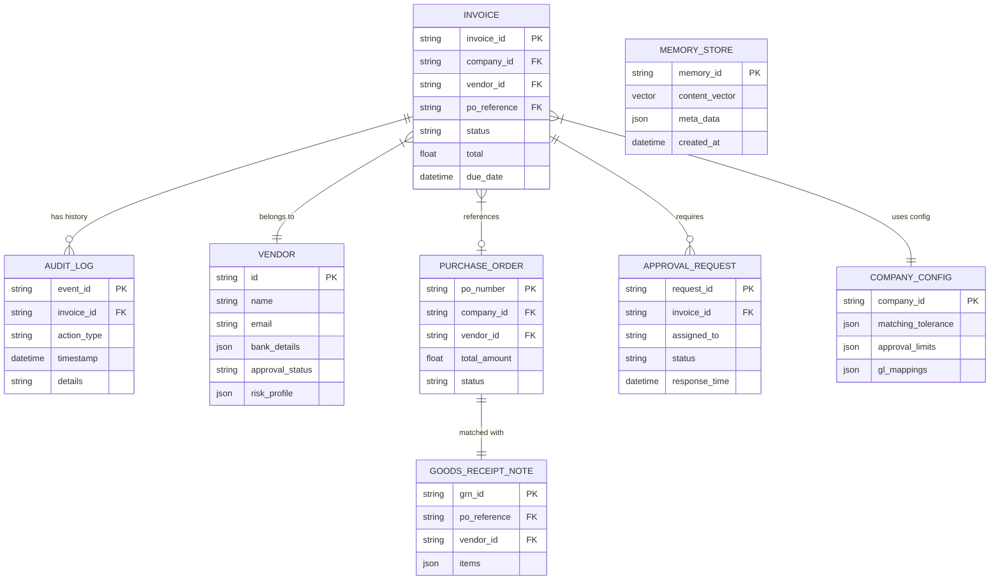

# Entity-Relationship Diagram (ERD)

This diagram visualizes the relationships between the MongoDB collections used in the AI Accounts Payable Employee system.

### Key:
- **PK**: Primary Key (Unique Identifier, Indexed)
- **FK**: Foreign Key (Reference to another entity)
- **||--o{**: One-to-Many
- **}|--||**: Many-to-One
- **||--||**: One-to-One
