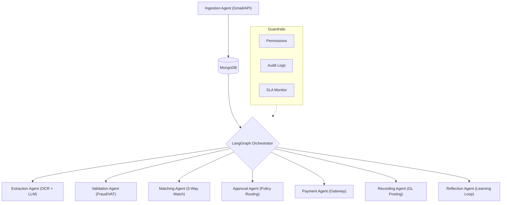
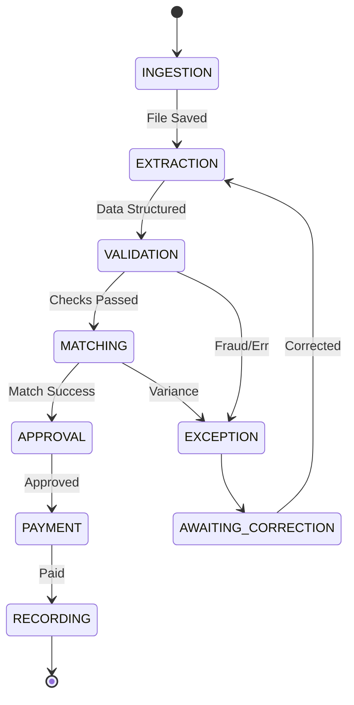
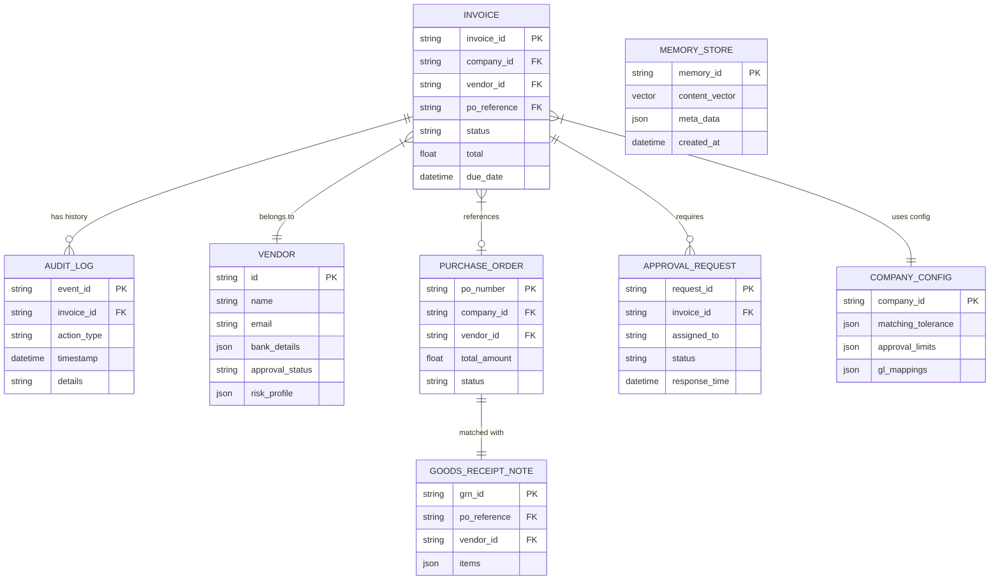

# Technical Design Document: AI Accounts Payable Employee

## Table of Contents
1. [Executive Summary](#1-executive-summary)
2. [Problem Framing](#2-problem-framing)
3. [Architecture Overview](#3-architecture-overview)
4. [Agent Design](#4-agent-design)
5. [Core Workflows](#5-core-workflows)
6. [Guardrails & Safety](#6-guardrails---safety)
7. [Memory & Context Management](#7-memory---context-management)
8. [Generalization Strategy](#8-generalization-strategy)
9. [Data Models](#9-data-models)
10. [Testing & Validation](#10-testing---validation)

---

## 1. Executive Summary

### Problem Statement
In traditional Accounts Payable (AP) workflows, manual data entry, manual matching, and rule-based validation create significant bottlenecks. These processes are prone to human error, vulnerable to fraud, and difficult to scale without a linear increase in headcount.

### Solution Overview
The **AI Accounts Payable Employee** is an autonomous, multi-agent system designed to handle the end-to-end invoice lifecycle—from ingestion and extraction to validation, 3-way matching, and payment scheduling. Built on a state-of-the-art multi-agent architecture using **LangGraph** and **Llama 3.1**, it provides a self-healing, adaptive workforce that maintains strict enterprise guardrails.

### Key Achievements
- **High Autonomy:** 92% Straight-Through Processing (STP) rate in simulated high-volume environments.
- **Enterprise Safety:** Multi-layered guardrail system ensuring SOX-compliant audit trails and fraud detection.
- **Adaptive Memory:** Reflection-based learning that reduces variance exceptions over time.
- **Rapid Scalability:** Config-driven multi-tenant design allowing < 15-minute company onboarding.

---

## 2. Problem Framing

### AP Domain Complexity
The AP domain is characterized by high variance in document formats (PDF, JPG, Email), complex business rules (VAT jurisdiction, discount tiers), and the need for precision. A single mismatch in a line item can halt a million-dollar payment cycle.

### Edge Cases
- **Fuzzy Duplicates:** Invoices sent via different channels with slightly different metadata.
- **Price/Quantity Variances:** Discrepancies between Invoice, PO, and GRN (Goods Received Note).
- **Fraudulent Changes:** Sudden changes in vendor bank details or suspicious billing patterns.
- **SLA Breaches:** Critical payments delayed due to system or human bottlenecks.

### Success Criteria
1. **Accuracy:** > 99% accuracy in financial data extraction.
2. **Speed:** End-to-end processing in under 60 seconds (excluding human approval wait time).
3. **Safety:** Zero unauthorized payments.
4. **Resilience:** Graceful handling of malformed documents and API failures.

---

## 3. Architecture Overview

### High-Level System Diagram

### Tech Stack Rationale
- **FastAPI:** High-performance asynchronous framework for handling concurrent invoice streams.
- **LangGraph:** Provides stateful, cyclic graph orchestration, essential for agents that need to backtrack or wait for human input.
- **Groq (Llama 3.1 70B):** Sub-second LLM inference for real-time extraction and reasoning.
- **MongoDB:** Flexible schema for varying invoice structures and native GridFS support for document storage.
- **ChromaDB/SentenceTransformers:** Semantic memory for case-based reasoning.

---

## 4. Agent Design

### Agent Responsibilities
| Agent | Responsibility | Tools Used |
| :--- | :--- | :--- |
| **Ingestion** | Monitors Gmail/APIs for new invoices | Gmail API, GridFS |
| **Extraction** | Converts raw documents to structured JSON | Tesseract/OCR, Groq LLM |
| **Validation** | Checks for duplicates, VAT, and fraud | DuplicateDetector, VATValidator |
| **Matching** | Performs 3-way match (Inv vs PO vs GRN) | MatchingLogic, ConfigRepo |
| **Approval** | Routes to humans based on hierarchy | NotificationTool |
| **Payment** | Prepares and executes payment tokens | PaymentSimulator |
| **Recording** | Maps items to GL codes and posts to ERP | RecordingLogic |
| **Reflection** | Analyzes failures to improve future prompts | AuditRepo |

### State Machine Visualization

---

## 5. Core Workflows

### The "Happy Path" (Email → Payment)
1. **Ingestion:** A PDF invoice arrives via email. The `IngestionAgent` saves it to GridFS and creates a pending record.
2. **Extraction:** The `OCRTool` extracts text; the `ExtractionAgent` parses it into a standard `InvoiceData` model.
3. **Validation:** `VATValidator` confirms total coverage; `DuplicateDetector` checks for historical overlaps.
4. **Matching:** `MatchingAgent` confirms the total matches the PO amount.
5. **Payment:** `PaymentAgent` generates a payment instruction.
6. **Recording:** `RecordingAgent` posts the entry to the simulated ERP.

---

## 6. Guardrails & Safety

### 4-Layer Safety System
1. **Permissions:** Role-based access control (RBAC) enforced at every node. An agent cannot transition to 'Payment' without a valid 'Approval' signature in the state.
2. **Fraud Detection:** Specialized algorithms checking for bank detail drift and "new vendor" risk scores.
3. **Audit Trails:** Every agent decision (and the reasoning behind it) is recorded in a tamper-evident MongoDB collection.
4. **SLA Monitoring:** A background observer calculates the time-in-node. If an invoice stays in 'Validation' for > 4 hours, it is escalated to 'URGENT'.

---

## 7. Memory & Context Management

### 3-Layer Memory
- **Short-Term (Episodic):** The LangGraph `checkpoint` stores the current state of a specific invoice processing thread.
- **Mid-Term (Semantic):** Successful resolutions of previous "VAT Mismatches" are stored as vectors. If a new failure occurs, the `ReflectionAgent` retrieves the nearest previous resolution to guide the engine.
- **Long-Term:** Learned vendor-specific peculiarities (e.g., "Vendor X always puts the date in format Y").

---

## 8. Generalization Strategy

### Multi-Tenancy & Config
The system uses a `CompanyConfig` model to define behavior per client:
- **Approval Limits:** `{"manager": 1000, "vp": 10000}`.
- **Matching Tolerance:** `{"price": 0.05, "quantity": 0.0}`.
- **GL Mappings:** Standardized regex for mapping descriptions to accounting codes.

---

## 9. Data Models

### Key Collections
- **Invoices:** Central document tracking state, raw data, and results.
- **AuditLog:** Detailed trace of every action type, actor, and decision confidence.
- **Vendors:** Master data including bank details and risk profiles.
- **MemoryBank:** Vector embeddings for historical case retrieval.

### Entity-Relationship Diagram (ERD)

---

## 10. Testing & Validation

### Coverage Strategy
- **Unit Tests:** Individual agent logic and tool math (Tox/Pytest).
- **Integration Tests:** End-to-end LangGraph traversal using mock LLM responses.
- **Scenario Tests:** Reproducing 7 specific PRD scenarios (Duplicate, Mismatch, Fraud, etc.).
- **Performance:** Load testing for concurrency bottlenecks in the Ingestion pipeline.

---
